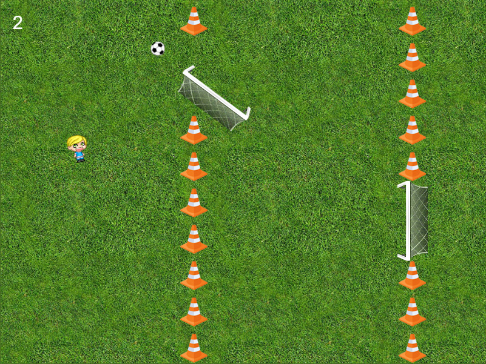

# Teo's entry to Ludum Dare 41

Ludum Dare 41 Theme was **"Combine 2 Incompatible Genres"**

## FLAPPY SOCCER

Combining the challenge of the Flappy genre, and the joy of scoring goals in soccer, Flappy Soccer offers quite big difficulty and fun experience. You need to score a goal to be able to pass through the gap, and of course catch the ball again, because you're gonna need it for the next gap!

Play here: http://ldjam.toffgames.com/41/



Language: TypeScript  
Framework: Phaser

**[Phaser NPM Webpack TypeScript Starter Project](https://github.com/rroylance/phaser-npm-webpack-typescript-starter-project)** used as boilerplate code.

Character created using http://www.avatarsinpixels.com  
Character code:  

```
eyJTb2NrcyI6IjIiLCJTaG9lcyI6IjQiLCJQYW50cyI6IjgiLCJUb3AiOiI2IiwiRXllYnJvd3MiOiIxIiwiRXllcyI6IjEiLCJNb3V0aCI6IjIxIiwiSGFpclRvcCI6IjUiLCJza2luVG9uZSI6ImY4Y2NhZSIsImhhaXJUb25lIjoiZWNkZDM3IiwiaGFpclRvbmUyIjoiMzMzMzMzIn0=
```

Other graphic art used from public domain

Crowd sound basic by FNC Effects - https://www.youtube.com/channel/UC9e-w6Yi2CvrLc4AJ9KaFzw  
Crowd sound goal cheer by Stephan Schutze - http://soundbible.com/1724-Large-Stadium.html


All other sound effects are originally recorded for this game.